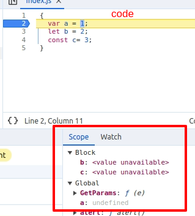

## Javascript Interview Questions
<ol>
<li>JavaScript is a synchronous, blocking, single-threaded language</li>
<li>Data Types : </li>
  <ul>
    <li> JavaScript has 8 Datatypes</li>
      <ul>
        <li>String</li>
        <li>Number</li>
        <li>Bigint</li>
        <li>Boolean</li>
        <li>Undefined</li>
        <li>Null</li>
        <li>Object</li>
      </ul>
    <li>The Object Datatype</li>
      <ul>
        <li>Object</li>
        <li>Array</li>
        <li>Date</li>
      </ul>
  </ul>  
<li>Function Statement</li>

```javascript
 function a() {
  console.log("Normal function is called Function Statement")
 }
``` 

<li>Function Expression</li>

```javascript
const b = function () {
  console.log("Function act like value is called function expression")
 }
``` 
<li>Anonymous Function</li>

```javascript
function () {
  console.log("Function wihtout name is called Anonymous function")
 }
``` 
```
output:
Syntax Error: Funcion statement requires a function name
```
```
Reason:
We assign anonymous function to variable, so that it does not throw error
Also in closure we can return anonymous function
```
<li>Named Function Expression</li>

```javascript
const b = function xyz() {
  console.log("Function whole value is a name function")
  console.log(xyz) // ll print function defination
 }
 b(); // valid
 xyz() // invalid
``` 
```
output:
Reference Error: xyz is not defined
```

<li>Difference Between Arguments and Parameter</li>
  <ul>
  <li> Arguments: Values that are passed with function during its calling</li>
  <li> b(1, 2):  1 and 2 are arguments for function b</li>
  </ul>
  <ul>
  <li> Parameter: Values that are defined with function during its defination</li>
  <li> function b(param1, param1){} : param1 & param2 are parameter</li>
  </ul>

<li>What is Depedency Injection ?</li>
  <ul><li> As name suggest it inject the depedency required in the function, Depedency injection allow framework to identify certain services that has been pre-configured in the code and inject it into other services</li></ul>
<li>What is Execution Context?</li>
  <ul>
    <li> When javascript program run's, first it create an empty execution context which consist of two part Memory & Code </li>
    <li>During the first phase i.e. memory creation phase javascript engine scans the whole program and allocate memory to all the variables and function. </li>
    <li>Variables are defined  with undefine value </li>
    <li>Function name stores the whole code as a value to the function </li>
    <li>For every function it ll create a new exection context and after the execution is completed it destroys that exectution context </li>
  </ul>
<li>What is call stack</li>
  <ul>
    <li>Whenever an execution context is created, it is added to the call stack. Initially, the global execution context is present in the call stack.</li> 
    <li>When a function is invoked, it creates a new execution context, which is then added to the call stack.</li> 
    <li>This approach ensures that even if multiple nested function invocations occur (i.e. a function is called inside another function, and inside that function, another function is called), the call stack maintains the proper execution of the code. The execution context is pushed or popped inside the call stack accordingly.</li> 
    <li>For global Execution Context it is name as anonymus and value of variables and function is stored in Global Memory and for every function it create Local memory </li> 
  </ul>
<li>Explain Hoisting</li>
  <ul>
    <li>Hoisting in javascript is a phenomenon through which we can access the variables and functions even before their initialization</li>
    <li>let and const are also hoisted but they are hoisted differently; they remain in temporal dead zone, which can been seen as Scope memory in Browser console until there initialization.</li>
    <li>let and const are block scope and var has global scope</li>
  </ul>
<li>What is Lexical Environment</li>
  <ul>
    <li>Lexical as a term means hirerachy i.e. in sequence</li>
    <li>Lexical environment consist of the local memory along with its lexical enviornment of parent</li>
    <li>Inside execution context reference to the lexical enviornment of the parent execution context is present</li>
  </ul>
  
<li>Var, Let & Const</li>
  <ul>
    <li> var
      <ul>
        <li> var has global scope</li>
        <li> if we try to access var variable before intitalization it will give undefined as the variable value</li>
      </ul>
    </li>
    <li>Let
      <ul>
        <li> let has block scope</li>
        <li> if we try to access let variable before intitalization it will give error</li>

  ```
  Uncaught ReferenceError: Cannot access 'a' before initialization
  ```

  <li>we can define let without any value</li>
      
  ```javascript
  let a;
  ```

  </ul>
  </li>
  <li>Const
  <ul>
    <li>const has block scope </li>
    <li> if we try to access const variable before intitalization it will give error</li>
  
  ```
  Uncaught ReferenceError: Cannot access 'a' before initialization
  ```
  <li>we cannot define const variable without any value</li>
  <li>if done program will not compile and throw error</li>
      
  ```javascript
  const a;
  ```
  
  ```
  'const' declarations must be initialized.
  ```
  </li>
  </ul>
  </li>

  <li>When we say that var has global scope and let and const has block scope, then that means in terms of memory as shown in image below
  
  

  </ul>

<li>Scope Chain</li>
  <ul>
    <li> chain of execution context with its parent lexical enviornment </li>
  </ul>
<li>Shadowing in Javascript</li>

  ```javascript
  var a = 10;
    {
      var a = 1;
      console.log(a);
    }
    console.log(a);
  ```
  <ul>
    <li>Inside block, variable a with value 1 is shadowing variable a from outside i.e. on line no. 1</li>
    <li>Both are referening to same memory space and because of this behaviour when value is changed in inner block then the value of a in line 1 will also be affected</li>
    <li>So in both console i.e on line 3 & 6 it ll print 1</li>
  </ul>
<li>Explain Closure</li>
  <ul>
    <li>Closure is a combination of a function and its lexical environment, which together form a closure.</li>
    <li>Because of closures, a function can access variables from its parent function even when it is executed in another scope.</li>
    <li>Advantages of closures.<br> It is used in many places like 
    <ul>
    <li>Function Currying</li>
    <li>Module Pattern</li>
    <li>It also help in data hiding and encapsulation</li>

  ```javascript
  var count = 0
  function counter {
      return ++count
  }
  const incrementCounter = counter()
  console.log(incrementCounter);
  ```
  ```
  Issue: anyone in program can change the value of count
  ```

  To hide count access for whole program or say to encapsulate it, we can use closures
  
  ```javascript
  function counter() {
    var counter = 0
    return function incrementCounter() {
      return ++counter
    }
  }

  const incrementCounter = counter()
  console.log(incrementCounter());
  ```  
  
  By this approach count is not accessible for outside program but the scope is limited till counter only and with the help of closures count is accessible inside incrementCounter

  </ul>
  <li> Closure function remembers its scope even after the execution</li>

  ```javascript
 function counter() {
  var count = 0;
  return function incrementCounter() {
    ++count;
    console.log('count: ', count);
  };
}

const incrementCounter = counter();
incrementCounter();
incrementCounter();
  ```  
  Output:

  ```
  count:  1
  count:  2
  ```
  Reason:
  ```
  after execution of 1st incrementCounter beacuse of closure it ll remember the increment value to 1
  And during second execution of incrementCounter it will increase the value to 2
  ```
  
  ```javascript
 function counter() {
  var count = 0;
  return function incrementCounter() {
    ++count;
    console.log('count: ', count);
  };
}

const incrementCounter1 = counter();
incrementCounter1();
incrementCounter1();
const incrementCounter2 = counter();
incrementCounter2();
incrementCounter2();
  ```  


  ```
  count:  1
  count:  2
   count:  1
  count:  2
  ```
  Reason:
  ```
  incrementCounter1 and incrementCounter2 ll be two differnt closure
  ```
  <li>Disadvantages of closure: over consumption of memory as for every function closure is formed.</li>
  </ul>
  
  ```javascript
    function foo() {
      let b = 1;
      function inner() {
        console.log(b);
      }
     inner();
    }

    foo()
  ```
<ul>
  <li>The output of the above code in console will be 1</li>
  <li>console.log(b) inside inner function is able to print value 1 because it has access to its parent lexical environment</li>
  <li>During execution the inner function will check if the value of b is present in the exection context of inner function </li>
  <li>As it was not there, it will traverse upward to its parent execution context and try to find the b in that execution context <br />And as it find the value of b it printed the value from there</li>
  <li>Incase if b was not present in foo then it would have travel upwards to its parent  execution context till the root to find the defination and at last it would have thrown error
</ul>

<li>What is First class function?</li>
  <ul>
    <li>The ability to use function as value and is called as First class function</li>
    <li>In javscript we can pass function as a value or also return a funtion just like a value, so this is called first class funtion </li>
  </ul>

<li>Explain Event Loop</li>
  <ul>
    <li>When we perform asynchronous operations, a callback function is created. <br/>Then this callback function is sent to the server(node js) or browser api(react js) for its execution and after this execution is completed it cant remain in server or browser api so it is required that it should be pushed into call stack again.<br/> However, since there may be other operations being performed at the same time in call stack, the callback function cannot go directly into the call stack. <br/> Instead, it is added to a callback queue. <br/>The event loop continuously monitors this queue and puts the callback function in the call stack accordingly.</li>
    <li>When we fetch the api data or use Promises function then it has higher priority then the other browser api, there's another stack is maintained called as microtask queue which has higher priority then the callback queue.</li>
  </ul>
<li>Immediate Invoke Function</li>
  <ul>
    <li>The function that run immediately is called Immediate Invoke Function</li>
    <li>Popular use case: To avoid declaring vairable in global scope.</li>
    <li>Syntax: write function inside roundbracket followed by round bracket to invoke i.e. (function)()
    </li>
  </ul>


  ```javascript
    // Anonymus Function:
    (function(){
      console.log('I am running immediately')
    })()
  ```

  ```javascript
    // Name Function with argument: 
    (immediateFunction = function(x) {
      console.log(`I am running immediately with ${x}`) 
    })(3);
    
    immediateFunction(2);

    output: 
    I am running immediately with 3
    I am running immediately with 2
    This will run code 2 time 1st bcoz of immediate syntax and second time because we called the function
  ```


<li>Currying in javascript:</li>
<ul>
  <li>Currying helps you avoid passing the same variable multiple times</li>
</ul>

  ```javascript
  let multiply = function(x) {
    return function(y) {
      return x*y
    }
  }

  let multiplyByTwo = multiply(2)

  console.log(multiplyByTwo(3))
  console.log(multiplyByTwo(4))
  ```

<ul>
  <li>This is used when one function value is constant and we want to test that function with different value then we use currying.<br/>So by this arrangement <br/>let multiplyByTwo = multiply(2) <br/> we dont have to pass 2 all the time, multiply(2) ll return another function which ll accept an argument.</li>
</ul>


<li>Debouncing:</li>
<ul>
  <li>Debouncing is a programming pattern or a technique to restrict the calling of a time-consuming function frequently, by delaying the execution of the function until a specified time to avoid unnecessary CPU cycles.</li>
  <li>For eg: in search bar instead of calling api on every Onchange event we can use debounce technique so that when user has finished its typing then only api ll get call</li>
  <li>Debounce ll wait for certain amount of time between two events. if another event is fired within time range then it ll not execute the functionality and when the time exceeds then only api functionality is gets called.</li>
</ul>


<li>Throttling</li>
  <ul>
    <li>Throttling implies limiting the number of times a function gets called in a certain time period.</li>
    <li>For eg: in search bar instead of calling api on every Onchange event we can use trottling technique so that the api is called when event is fired 1st time and then it ll wait for certain time ignoring event getting fired in the same time range and then when the time is completed it ll execute the functionality
    </li>
  </ul>
  
<li>Explain Web worker</li>
  <ul>
    <li>Allows scripts to run in the background in separate threads to prevent scripts from blocking one another on the main thread.</li>
    <li>Javascript is by default single threaded language which is called as main thread</li>
    <li>Web worker is a seprate thread which allow  multiple thread to execute parallel to each other</li>
    <li>Web worker can perform any dom manupulations.</li>
    <li>Service worker is a javscript file that is run by client browser in background seprate from our webpage and it handle event fired by browser or webpage and since it run in the background it doesn need  the webpage to be open</li>
  </ul>

<li>Explain Service Worker</li>
  <ul>
    <li>A type of Web Worker that creates a background service that acts middleware for handling network requests between the browser and server, even in offline situations.</li>
    <li>Service worker is a javscript file that is run by client browser in background seprate from our webpage and it handle event fired by browser or webpage and since it run in the background it doesn need  the webpage to be open</li>
  </ul>
<li>Explain Shallow Copy:</li>
<ul>
  <li>When a reference variable is copied into a new reference variable using the assignment operator, a shallow copy of the referenced object is created.<br/>In simple words, a reference variable mainly stores the address of the object it refers to.</li>
</ul>

```javascript
 let employee = {
 eid: "E102",
 ename: "Jack",
 eaddress: "New York",
 salary: 50000
}

console.log("Employee=> ", employee);
let newEmployee = employee; // Shallow copy
console.log("New Employee=> ", newEmployee);

console.log("---------After modification----------");
newEmployee.ename = "Beck";
console.log("Employee=> ", employee);
console.log("New Employee=> ", newEmployee);
```
output:
```
Employee=>  { eid: 'E102', ename: 'Jack', eaddress: 'New York', salary: 50000 }
New Employee=>  { eid: 'E102', ename: 'Jack', eaddress: 'New York', salary: 50000 }
---------After modification----------
Employee=>  { eid: 'E102', ename: 'Beck', eaddress: 'New York', salary: 50000 }
New Employee=>  { eid: 'E102', ename: 'Beck', eaddress: 'New York', salary: 50000 }
```

<li>Explain Deep Copy</li>
  <ul>
    <li>Unlike the shallow copy, deep copy makes a copy of all the members of the old object, allocates a separate memory location for the new object, and then assigns the copied members to the new object.<br/> In this way, both the objects are independent of each other and in case of any modification to either one, the other is not affected. </li>
  </ul>

  ```javascript
  let employee = {
  eid: "E102",
  ename: "Jack",
  eaddress: "New York",
  salary: 50000
  }
  console.log("=========Deep Copy========");
  let newEmployee = JSON.parse(JSON.stringify(employee));

  console.log("Employee=> ", employee);
  console.log("New Employee=> ", newEmployee);
  console.log("---------After modification---------");
  newEmployee.ename = "Beck";
  newEmployee.salary = 70000;
  console.log("Employee=> ", employee);
  console.log("New Employee=> ", newEmployee);
  ```
  output
  ```
  =========Deep Copy========
Employee=>  { eid: 'E102', ename: 'Jack', eaddress: 'New York', salary: 50000 }
New Employee=>  { eid: 'E102', ename: 'Jack', eaddress: 'New York', salary: 50000 }
---------After modification---------
Employee=>  { eid: 'E102', ename: 'Jack', eaddress: 'New York', salary: 50000 }
New Employee=>  { eid: 'E102', ename: 'Beck', eaddress: 'New York', salary: 70000 }
  ```
<li>Difference between call, apply, bind</li>
<ul>
  <li>With these method we can define were the this keyword should refer to</li>
  <li>in Call: we pass arguments normally & it executes the function.</li>
  <li>in Apply: we pass argument as array & it executes the function.</li>
  <li>in Bind: we have to pass arguments normally but it does not execute the function instead it returns the copy of the function.</li>
</ul>

```javascript
let name1 = {
firstName:"Sumeet",
lastName: "Jadhav"
}
let name2 = {
firstName:"Tony",
lastName: "Stark"
}
const printName = function (hometown, state) {
   console.log(this.firstName+"  "+this.lastName+"  "+hometown+ " "+state)
} // can't use ES6 syntax as this keyword ll return undefined
```

Call
```
printName.call(name1, "Nagpur", "Maharashtra")  // this ll run the printName function with this keyword referring to name1
```

Apply
```
printName.apply(name2, ["Nagpur", "Maharashtra"])  // this ll run the printName function with this keyword referring to name2
```

Bind
```
const printWithBind= printName.bind(name1, "Nagpur", "Maharashtra")  // this ll not run the printNamefunction instead it will create a copy of the print function with this keyword referring to name1 
printWithBind() // we need to expliciltly call the new funtion
```

<li>Difference between Normal,Async, differ</li>
<ul>
  <li>Normal Parsing:</li>
  <ul>
    <li>When we load a script in html so the execution happens is like <br/>
      <ul>
        <li>First the html parsing is done line by line</li>
        <li>As soon as it encounter the script import tag, it ll halt the current parsing and download the js script</li>
        <li>Afterwards it ll execute the script After the execution of the external script is complete it ll resume the parsing of the halted html</li>
      </ul>
  </ul>
  <li>Async Parsing:</li>
  <ul>
    <li>When we load a script in html so the execution happens is like <br/>
      <ul>
        <li>First the html parsing is done line by line</li>
        <li>As soon as it encounter the script import tag, it will tell the browser to download the javascript file in background and it ll continue to parse the main html code </li>
        <li>As soon as downloading is done, then it ll halt the parsing of main html and execute the javsascript and after execution it ll resume parsing of the main file</li>
        <li>The issue is if we are downloading multiple javascript file so as per network speed or other factors the download ll be done in random manor every time and due to this the result ll differ </li>
      </ul>
  </ul>
</ul>
<li>Event Bubbling and Event capturing:</li>
  <ul>
    <li>The standard DOM Events describes 3 phases of event propagation:</li>
    <ol>
      <li>Capturing phase – the event goes down to the element.</li>
      <li>Target phase – the event reached the target element.</li>
      <li>Bubbling phase – the event bubbles up from the element.</li>
    </ol>
  </ul>

  [Check Full Detail Here](https://javascript.info/bubbling-and-capturing)

<li>Explain Undefined and not defined:</li>
  <ul>
    <li>Undefined: </li>
    <ol>
      <li>When we initialize the variable, javascript engine scans the whole program and allocate memory to all variable, it defines the variable with undefined value.</li>
    </ol>
  </ul>
  <ul> 
    <li>Not defined:</li>
    <ol>
      <li>Not defined is when javscript trys to find the defination of some variable/function and its not present in the program then it throws Reference error: variableName is not defined.</li>
    </ol>
  </ul>

</ol>